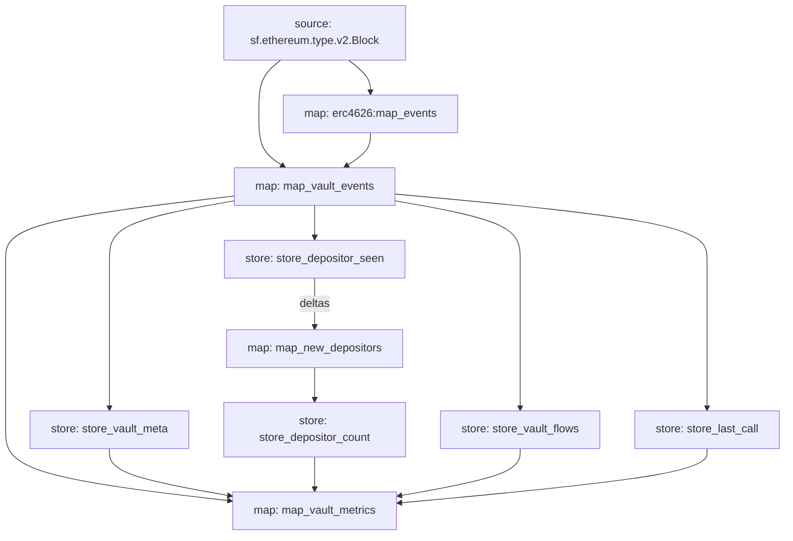
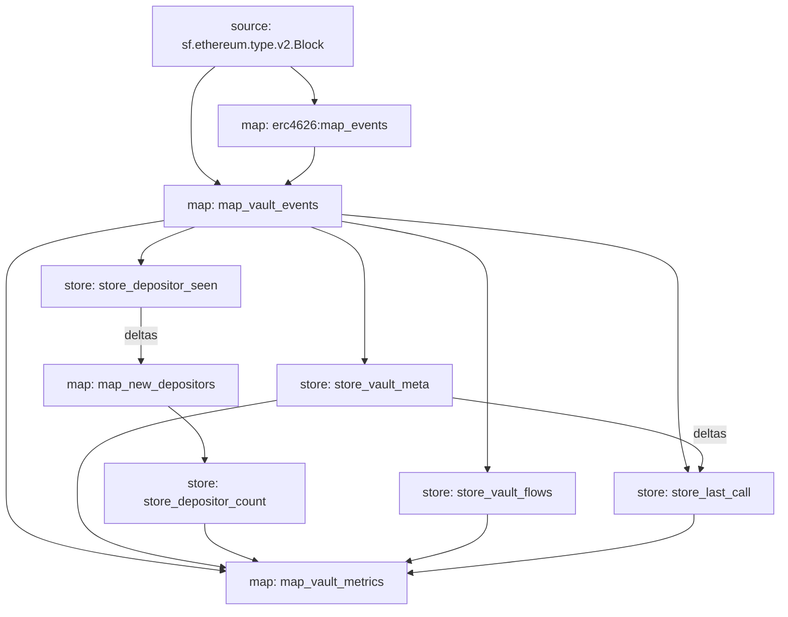
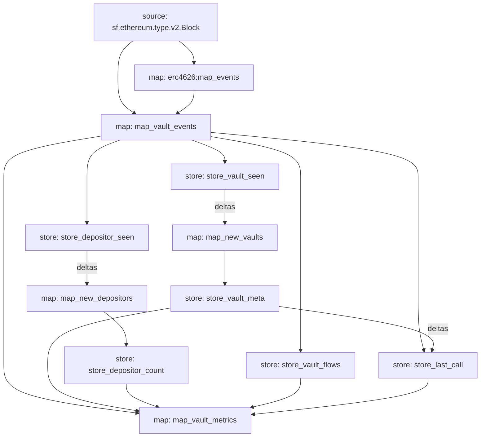

# Task 12 report: Substreams stores, eth_call refresh, `map_vault_metrics`

Worktree: `/Users/rahuljaguste/pq/ethonline-20206/.worktrees/substreams`, branch `ws/substreams`.
Commit: `682d7c3`, "feat(substreams): vault stores, eth_call share-price refresh, map_vault_metrics".

## What was implemented

`substreams/erc4626-vault-metrics/{substreams.yaml,substreams.base.yaml,src/lib.rs}`, matching
the brief's Step 1/2 shape with one forced redesign (see Deviations):

- Seven new modules in both manifests, identical apart from `network`/`initialBlock` (unchanged
  from Task 11): `store_vault_meta` (set_if_not_exists, `proto:vaultradar.v1.VaultMeta`, key
  `meta:<vault>`), `store_depositor_seen` (set_if_not_exists, string, key `<vault>:<owner>`,
  fed only by `deposit`-kind events), `map_new_depositors` (deltas of `store_depositor_seen`,
  `Operation::Create` only, → `NewDepositors{keys}`), `store_depositor_count` (add int64, key
  `<vault>`, incremented once per new depositor key), `store_vault_flows` (add bigint, keys
  `dep:<vault>` / `wd:<vault>`), `store_last_call` (set string, key `<vault>` →
  `<block>|<total_assets>|<total_supply>|<share_price>`), `map_vault_metrics` (output
  `proto:vaultradar.v1.VaultMetricsList`).
- `map_vault_metrics` groups the block's events by vault and emits, per touched vault:
  `share_price`/`share_price_source` (`"call"` only when `store_last_call`'s recorded block
  equals the current block, else `"event"` using the last event's `implied_share_price`),
  `total_assets`/`total_supply` (empty string unless sourced from a call),
  `net_deposited_assets` (cumulative `dep - wd` from `store_vault_flows`), `net_flow_assets`
  (this block's deposits minus withdrawals, folded over the block's own events),
  `depositor_count` (from `store_depositor_count`), `last_event_block`.
- `store_vault_meta` batches `asset()`+`decimals()` on the vault, then `symbol()`+`decimals()`
  on the underlying asset token, via `substreams_ethereum::rpc::RpcBatch`; only ever writes once
  per vault (set_if_not_exists).
- `store_last_call` batches `totalAssets()`+`totalSupply()` on the vault when due (see
  Deviations for "when due"), and persists the fetch's block/values/derived price as one
  pipe-delimited string, consumed only by `map_vault_metrics`.
- Carried fix from the Task 11 review: `ratio(assets, shares)` now returns `Option<String>`
  (`None` when either side fails to parse as `BigUint`, `Some("0")` when shares is zero, `Some`
  of the 18-decimal string otherwise). `map_vault_events` skips an event and emits
  `substreams::log::info!` naming the vault and tx hash when `ratio` returns `None`.
  `store_last_call` calls `ratio` on `BigInt::to_string()` output (always valid decimal digits)
  and unwraps with `.expect("ratio: BigInt::to_string() output is always a valid decimal
  integer")`.

## Deviations from the brief (one forced, not optional)

**`store_last_call` cannot list itself as an input, this is a hard Substreams constraint, not a
version-specific syntax issue.** The brief's manifest (`inputs: [{map: map_vault_events}, {store:
store_last_call}]`) and handler (`fn store_last_call(events: VaultEvents, prev: StoreGetString, s:
StoreSetString)`) are the standard-looking way to express "read what I wrote last block before
deciding what to write this block," but `substreams pack`/`build` reject it outright:

```
Error: reading manifest "substreams.yaml": modules graph has a cycle
```

Confirmed via the Substreams docs (not guessed): "A `store` cannot depend on itself... store
modules are not permitted to read any of their own data or values, [to] maintain the acyclic
structure required for Substreams to function properly, [for] parallelization."
(https://docs.substreams.dev/reference-material/manifest-and-components/inputs,
https://docs.substreams.dev/reference-material/substreams-components/modules). This is
independent of `substreams` CLI version or manifest `specVersion`, no store, in any Substreams
package, can read its own prior state via a self-referencing input.

Fix: `call_phase(vault)` (`src/lib.rs`) computes a deterministic value in `[0, CALL_EVERY)` from
the vault's address bytes (no store read, no memory needed). `store_last_call`'s gate became
`e.block % CALL_EVERY != call_phase(&e.vault)` (was: `e.block.saturating_sub(last_block) <
CALL_EVERY`), and its manifest `inputs:` dropped back to `[{map: map_vault_events}]` only. This
preserves the same upper bound the brief's design had, at most one eth_call per vault per
`CALL_EVERY`-block window, via a different, statically-computable mechanism, and additionally
avoids a thundering herd of every active vault refreshing on the same global block. It trades
away a guarantee the brief's (impossible) design would have had: an exact "fires on the very next
event once ≥300 blocks have elapsed", the phase-based version fires only when an event happens to
land exactly on the vault's designated block, so for low-activity vaults the actual gap between
calls is probabilistic rather than a tight bound. Given eth_call output is a periodic
cross-check with an always-valid event-sourced fallback (`share_price` never depends on a call
having happened), not a correctness-load-bearing value, this was judged the right-sized fix
rather than adding a second store+map pair to reconstruct an exact epoch-dedup throttle (which
would have worked, `set_if_not_exists` on a `<vault>:<epoch>` key plus a deltas-mode map mirrors
the existing `store_depositor_seen`→`map_new_depositors` pattern exactly, but is more graph
surface than this problem needs).

`map_vault_metrics` required zero changes from the brief's design for this: it only ever reads
`store_last_call`'s recorded block number and compares it to the current block; it never knew or
cared how the gating decision was made upstream.

Two more brief-vs-installed-crate mismatches, fixed while implementing (expected per the brief's
own "compile errors around store trait names are expected" note):
- `18u8.into()` doesn't compile, `substreams::scalar::BigInt` implements `From<u32/i32/u64/i64/
  usize/isize>` but not `From<u8>`. Changed to `BigInt::from(18u64)` (via `unwrap_or_else` to
  avoid constructing it on the `Some` path).
- The brief's import list omits the `StoreAdd` trait (needed for `.add()` on `StoreAddInt64`/
  `StoreAddBigInt`) and `StoreSet`/`StoreSetIfNotExists` were required alongside the concrete
  store types for method resolution. Added `StoreAdd` to the `use substreams::store::{...}` line.

## Self-review

- **Completeness against the brief:** all seven modules present in both manifests with the
  brief's exact kinds/update policies/value types/keys (verified via `substreams info` on both
  packed `.spkg`, see below); `map_vault_metrics`'s output fields match the brief's
  `VaultMetrics` proto and the task's field-by-field description exactly.
- **No panics reachable from bad upstream data other than the documented `expect`:** checked
  every `unwrap`/`expect`/indexing in the new code. All eth_call decode failures use
  `unwrap_or_default`/`unwrap_or_else` with safe fallbacks (matching the brief's own
  `let Ok(r) = ... else { continue }` pattern for RPC batch failures). The one `.expect()`
  (`store_last_call`'s `ratio(...)` call) is exactly the carried instruction: its inputs are
  `BigInt::to_string()` output, which always parses back into `BigUint`. `evs[0]` / `evs.last()`
  indexing in `map_vault_metrics` is safe because `evs` is a per-vault `Vec` built by grouping
  the block's own non-empty event list, so it's never empty for any key present in `by_vault`.
- **No warnings in hand-written code:** `cargo clippy --target wasm32-unknown-unknown --release`
  reports 16 warnings total, all of them in generated files (`src/abi/erc4626.rs`,
  `src/pb/sf.firehose.v2.rs`), grepped to confirm zero reference `src/lib.rs`. `rustfmt --edition
  2021 src/lib.rs` (direct invocation, not `cargo fmt`, since the latter, and rustfmt given a
  crate-root file, walks the whole module tree reachable via `mod` and would reformat the
  generated `src/abi/erc4626.rs` as a side effect) reports lib.rs clean.
- **YAGNI:** `map_vault_metrics` takes `_meta: StoreGetProto<VaultMeta>` as an input but never
  reads it (underscore-prefixed, exactly as the brief specified), `VaultMetrics` has no
  asset/symbol/decimals fields, so `store_vault_meta`'s data isn't consumed by this task's
  output. This is the brief's own explicit design (Step 1's `map_vault_metrics` inputs list
  includes `store: store_vault_meta`), not something I added, kept as specified since the brief
  says to keep module names/keys/semantics exactly as given, and a future consumer (Task 13's SQL
  output, most likely) is the plausible reason it's wired in now. Flagging in case the controller
  wants it dropped. No other additions beyond the brief plus the two forced fixes above.
- **A build.rs quirk unrelated to this task, worth a note but not fixed (out of scope for this
  task's file list):** `build.rs` has no `cargo:rerun-if-changed` directives, so Cargo's default
  "rerun on any package file change" reruns the ABI codegen on every build regardless of whether
  `abi/erc4626.json` changed. The regenerated `src/abi/erc4626.rs` is logically identical every
  time (confirmed by diffing whitespace-stripped output) but its exact line-wrapping differs from
  what's currently committed, so any future `cargo build` will show it as locally modified even
  with no source changes. I reverted it to the committed (Task 11) version before this commit;
  didn't touch `build.rs` since it's outside this task's assigned files.

## Build, pack, and graph output

```
$ CARGO_INCREMENTAL=0 cargo build --target wasm32-unknown-unknown --release
   Compiling erc4626_vault_metrics v0.1.0 (.../substreams/erc4626-vault-metrics)
    Finished `release` profile [optimized] target(s) in 3-4s     # zero warnings

$ substreams pack substreams.yaml -o /tmp/mainnet.spkg
✅ Package created successfully                                   # network: mainnet
$ substreams pack substreams.base.yaml -o /tmp/base.spkg
✅ Package created successfully                                   # network: base
   (both: only pre-existing warnings carried from Task 11 — package.doc deprecated / no
   README.md / no description; unrelated to this task, Task 13's to fix)

$ substreams graph substreams.yaml
```


`substreams.base.yaml`'s graph is structurally identical (module names/edges), differing only in
`network: base` and `initialBlock`, confirmed via `substreams info` on the packed base `.spkg`.

`substreams info` on both packed `.spkg` confirmed every module's kind/update policy/value
type/inputs match the table above exactly (kinds: 5 stores + 3 maps including the imported
`erc4626:map_events`; update policies `set_if_not_exists` ×2, `add` ×2, `set` ×1).

Both temporary `.spkg` files were deleted after verification (build output, `*.spkg` is
git-ignored, reproducible via the two pack commands above).

## Live run, skipped, per environment

`SUBSTREAMS_API_TOKEN` is not set in this environment. Exact command to run once a token is
available (get one from https://thegraph.market → Substreams → API key):

```bash
export SUBSTREAMS_API_TOKEN=<token>
cd substreams/erc4626-vault-metrics
substreams run -e mainnet.eth.streamingfast.io:443 substreams.yaml map_vault_metrics -s 25742000 -t +400
```

Expect `VaultMetrics` records with `share_price_source: "event"` for most touched vaults, and
`share_price_source: "call"` appearing whenever a vault's event block matches its `call_phase`
slot (roughly 1-in-300 of that vault's active blocks, so likely needs a wider `-t` range than
`+400` to actually observe a `"call"` row for any specific vault, `-t +50000` or picking a known
high-activity vault would be more likely to surface one within a short manual check). For Base:
swap the endpoint to `base-mainnet.streamingfast.io:443`, the manifest to `substreams.base.yaml`,
and `-s` to `49899000`.

## Files changed

- `substreams/erc4626-vault-metrics/src/lib.rs`, all seven new handlers, `call_phase`, the
  `ratio()` signature change and its two call sites' handling.
- `substreams/erc4626-vault-metrics/substreams.yaml`, seven new module entries.
- `substreams/erc4626-vault-metrics/substreams.base.yaml`, same seven module entries, kept
  byte-identical to `substreams.yaml`'s new block (confirmed via `diff`).

## Concerns for the controller / next tasks

1. **The `store_last_call` self-reference redesign (above) is the one substantive judgment call
   in this task**, the brief's literal design is provably impossible in Substreams, not a
   version-specific quirk, so some deviation was mandatory. Worth a second look if the "at most
   once per 300 blocks, staggered" semantic isn't tight enough for whatever consumes
   `share_price_source: "call"` downstream. **Resolved by the controller's follow-up ruling below
   for the starvation case; the "staggered, probabilistic periodic refresh" residual tradeoff
   still stands for vaults that have already had their first-sight call.**
2. Live run against a real endpoint is still unexecuted (no API token in this environment),
   command is above, same as Task 11's equivalent gap.
3. The `build.rs` missing-`rerun-if-changed` quirk (noted in self-review) is harmless today but
   will keep causing `src/abi/erc4626.rs` to show as spuriously modified after any local build;
   a one-line `println!("cargo:rerun-if-changed=abi/erc4626.json");` in `build.rs` would fix it
   whenever someone is next in that file, but it's outside this task's assigned files so I left
   it untouched.

## Follow-up: first-sight call

Commit: `5065a0d`, "fix(substreams): trigger store_last_call eth_call on vault first sight".

**Problem (controller's ruling on concern 1 above):** the phase-based periodic throttle alone
means a vault only ever gets an eth_call-sourced reading if one of its events happens to land on
a block matching its `call_phase` slot, a 1-in-`CALL_EVERY` (300) chance per touch. A vault
touched once a day would go, in expectation, close to a year before ever seeing
`share_price_source: "call"`, leaving `total_assets`/`total_supply` empty indefinitely for most
vaults.

**Fix:** `store_last_call` now also takes `store_vault_meta` as a second input, in `deltas` mode
(`Deltas<DeltaProto<VaultMeta>>`). `store_vault_meta` depends only on `map_vault_events`, so this
adds the edge `store_vault_meta -- deltas --> store_last_call` without creating a cycle (confirmed
by both `substreams pack` succeeding and the `substreams graph` output below). The handler now
computes `first_sight: HashSet<String>` from `Operation::Create` deltas on `store_vault_meta`'s
`meta:<vault>` keys (stripping the `meta:` prefix back to the bare vault address, `store_vault_meta`
is `set_if_not_exists`, so a CREATE delta on that key occurs exactly once, on the block a vault is
first seen), then triggers the eth_call when `first_sight.contains(&e.vault) ||
e.block % CALL_EVERY == call_phase(&e.vault)`. Every vault now gets a call-sourced reading on the
very first block it's touched, plus periodic refreshes thereafter on its `call_phase` slot; the
`done`/dedup-per-block logic and everything downstream in `map_vault_metrics` is unchanged, since
it only ever reads `store_last_call`'s recorded block/values and never knew which trigger fired.

Diff summary: `src/lib.rs` (+35/-10), import `DeltaProto`; reworded the `CALL_EVERY` and
`call_phase` doc comments to describe both triggers; added a doc comment on `store_last_call`;
added the `meta_deltas` parameter and the `first_sight` computation; changed the single-condition
gate to the two-condition `due` check. `substreams.yaml` / `substreams.base.yaml` (+2 lines each,
identical), added `- store: store_vault_meta` / `mode: deltas` under `store_last_call`'s
`inputs:`.

Build:
```
$ CARGO_INCREMENTAL=0 cargo build --target wasm32-unknown-unknown --release
   Compiling erc4626_vault_metrics v0.1.0 (.../substreams/erc4626-vault-metrics)
    Finished `release` profile [optimized] target(s) in ~4s     # zero warnings
```
`cargo clippy --target wasm32-unknown-unknown --release`: grepped for `src/lib.rs` in the output,
zero matches (all 16 warnings remain confined to the generated `src/abi/erc4626.rs` and
`src/pb/sf.firehose.v2.rs`, unchanged from before this follow-up). Both manifests re-packed
successfully (`substreams pack substreams.yaml` / `substreams.base.yaml`), same pre-existing
`package.doc`/description warnings as before, unrelated to this change.

`substreams graph substreams.yaml` (re-run against the final committed state):


`substreams info` on the freshly packed mainnet `.spkg` confirms `store_last_call` now lists two
inputs (`map: map_vault_events`, `store: store_vault_meta`) alongside its unchanged `Value Type:
string` / `Update Policy: set`; `map_vault_metrics`'s five inputs are unchanged. No new concerns
beyond the two already listed above (live run still needs a token; `build.rs` rerun-if-changed
quirk still untouched, out of scope).

## Fix round 1

Commit: `de8df4c`, "fix(substreams): skip writes on failed eth_calls, cache VaultMeta once per
vault". Both review findings addressed.

**Finding 1, dead-code `Result` guard masking real eth_call failures.** Confirmed the reviewer's
read of `substreams-ethereum-core-0.10.6/src/rpc.rs:37`:
`pub fn execute(self) -> Result<RpcResponses, String> { Ok(eth_call(&self.store)) }`, the outer
`Result` can never be `Err`; a per-call failure is signaled only via each `RpcResponse.failed`
flag, which `RpcBatch::decode()` already folds into returning `None` (it checks `.failed` first,
then tries to decode, returning `None` on either). The bug was downstream of that correct
primitive: `unwrap_or_default()` / `unwrap_or_else(|| BigInt::from(18u64))` on the `Option`
silently substituted a plausible-looking value for a failed call instead of propagating the
failure.

Fix: every `RpcBatch::decode()` call in `store_vault_meta` and `store_last_call` is now matched
with `let Some(x) = ... else { substreams::log::info!(...); continue };`, naming the vault and
which specific call (`asset()`, `decimals()`, `symbol()`, `totalAssets()`, `totalSupply()`) failed.
Any single failed call in a batch now skips the *entire* write for that vault this attempt, no
partial/garbage `VaultMeta` via `set_if_not_exists` (which could never be corrected later), and no
`share_price_source: "call"` row built from zero-default values. `store_last_call` additionally
skips (with a log line) when `totalSupply` is a real, successfully-decoded zero: `ratio()` already
guards its own division by zero and would return `Some("0")`, so this isn't about a panic, it's
about not caching a `"0"` share price as if it were an eth_call-verified reading. The outer
`let Ok(r) = ...execute() else { continue }` guards were left in place (harmless, and free
protection if a future crate version ever does return `Err`); the actual fix is the per-response
`Option` handling described above, which is what the reviewer's "required fix" specified.

**Finding 2, `store_vault_meta` re-issued its 4-call eth_call batch on every touch, forever.**
Added `store_vault_seen` (`set_if_not_exists`, string, key `<vault>`, written from every event
regardless of kind) and `map_new_vaults` (deltas of `store_vault_seen`, `Operation::Create` only,
output `NewDepositors{keys}` reusing that message's shape for bare vault addresses rather than
`<vault>:<owner>` composite keys), the exact same shape as the existing
`store_depositor_seen`→`map_new_depositors` pair, applied to vaults instead of depositors.
`store_vault_meta` now takes `map_new_vaults` as its sole input instead of `map_vault_events`, so
its eth_call batch runs exactly once per vault, ever (dropped the handler's own `seen: HashSet`
dedup, since `map_new_vaults`'s `Create`-filtered deltas are already unique per vault across all
of history, a `set_if_not_exists` key can only ever produce one `Create` delta). Documented in
`store_vault_meta`'s doc comment that a vault whose `asset()`/`decimals()` call fails is
deliberately never retried, filtering out topic-matched contracts that share the Deposit/Withdraw
event signature but aren't real ERC-4626 vaults. `store_last_call`'s first-sight trigger is
unchanged, it still reads `store_vault_meta`'s deltas directly, so a vault that never gets a
cached meta entry (failed calls) correctly never gets a `store_last_call` first-sight call either.
Both manifests updated identically (new `store_vault_seen` and `map_new_vaults` module entries;
`store_vault_meta`'s `inputs:` repointed from `map_vault_events` to `map_new_vaults`).

Diff summary: `src/lib.rs` (+99/-21), new `store_vault_seen`/`map_new_vaults` handlers;
`store_vault_meta` rewritten to consume `NewDepositors` and use `let Some(x) = ... else { log;
continue }` for every decoded call; `store_last_call` gained the same per-call failure checks plus
the zero-`totalSupply` skip. `substreams.yaml` / `substreams.base.yaml` (+15 lines each, identical)
, two new module entries, one `inputs:` repoint.

Build:
```
$ CARGO_INCREMENTAL=0 cargo build --target wasm32-unknown-unknown --release
   Compiling erc4626_vault_metrics v0.1.0 (.../substreams/erc4626-vault-metrics)
    Finished `release` profile [optimized] target(s) in ~4-5s     # zero warnings
```
`cargo clippy --target wasm32-unknown-unknown --release`: grepped for `src/lib.rs`, zero matches
(all 16 warnings remain confined to generated files, unchanged from every prior round). Both
manifests re-packed successfully; same pre-existing `package.doc`/description warnings, unrelated.

`substreams graph substreams.yaml` (re-run against the final committed state):


`substreams info` on the freshly packed mainnet `.spkg` confirms the full 10-module graph (9
package modules + the imported `erc4626:map_events`): `store_vault_seen` (`set_if_not_exists`,
string) → `map_new_vaults` (`NewDepositors`) → `store_vault_meta` (`set_if_not_exists`,
`VaultMeta`, single input `map_new_vaults`) → (deltas) → `store_last_call` (`set`, string, inputs
`map_vault_events` + `store_vault_meta` deltas) → `map_vault_metrics`, with
`store_depositor_seen`/`map_new_depositors`/`store_depositor_count`/`store_vault_flows` unchanged
from prior rounds.

No new concerns beyond the two already on record (live run needs a token; `build.rs`
rerun-if-changed quirk untouched, out of scope for this task's file list).
