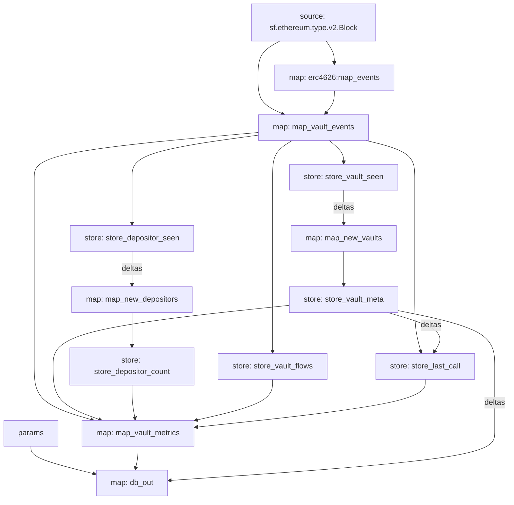

# Task 13 report: Substreams SQL sink, Neon deployment, and publishing

Worktree: `/Users/rahuljaguste/pq/ethonline-20206/.worktrees/substreams`, branch `ws/substreams`.
Commit: `f95c1a0`, "feat(substreams): db_out SQL sink module, schema.sql, and package README".

Status: **DONE_WITH_CONCERNS.** All offline deliverables (schema, `db_out` module, both manifests,
README, build/pack/graph verification, local Postgres sink setup) are complete and verified. Live
sinking to a real chain and publishing to substreams.dev are unexecuted, per the ruling, because
`SUBSTREAMS_API_TOKEN` and `DATABASE_URL` are not available in this environment, exact commands
for both are below and in `README.md`. Two required deviations from the brief/ruling were forced
by facts only discoverable by actually building and running against a real database; both are
documented in detail below and in code comments.

## What was implemented

`substreams/erc4626-vault-metrics/`:

- **`schema.sql`** (new), `vault_metrics` (history, PK `(chain_id, vault, block)`), `vault_latest`
  (snapshot, PK `(chain_id, vault)`), `vault_meta` (PK `(chain_id, vault)`), plus the
  `vault_metrics_ts` index, matches the brief's Step 1 exactly, reformatted to multi-line SQL with
  a header comment (same reformatting convention Tasks 11/12 used for the brief's dense one-liners;
  zero column/type/constraint changes).
- **`db_out` map module** (`src/lib.rs`), inputs `params: string` (→ `chain_id: String`),
  `map_vault_metrics` (→ `VaultMetricsList`), `store_vault_meta` in `deltas` mode (→
  `Deltas<DeltaProto<VaultMeta>>`); output `proto:sf.substreams.sink.database.v1.DatabaseChanges`.
  For each `VaultMetrics`: a `create_row` into `vault_metrics` (history) and an `upsert_row` into
  `vault_latest` (snapshot; see Deviation 2 for why `upsert_row` instead of the
  brief's `create_row`/`update_row` split). `total_assets`/`total_supply` skip `.set()` when the
  source string is empty, in both tables, so the column lands as SQL `NULL` rather than `''`,
  exactly as instructed. For each Create delta on `store_vault_meta`: a `create_row` into
  `vault_meta` (a `set_if_not_exists` store can only ever emit one delta per key, so filtering to
  Create is a no-op today but matches the ruling's instruction and guards against a future change
  to that store's update policy).
- **Both manifests**, `database_change` import, `db_out` module entry, `params: {db_out: "1"}` /
  `{db_out: "8453"}`, and the `sink:` block (`module: db_out`, `type:
  sf.substreams.sink.sql.v1.Service`, `config: {schema: "./schema.sql", engine: postgres}`),
  identical between `substreams.yaml` and `substreams.base.yaml` apart from
  `network`/`initialBlock` (unchanged from Tasks 11/12) and the required `params.db_out` chain-id
  value, confirmed via `diff` (only those lines plus proportional comment-verbosity differences
  differ; see Deviation 1's comment, which is fully spelled out in `substreams.yaml` and just
  cross-referenced from `substreams.base.yaml`).
- **`Cargo.toml`**, added `substreams-database-change = "2.1.1"` (see Deviation 1) and a
  `[lints.clippy]` table setting `not_unsafe_ptr_arg_deref = "allow"` (see "Clippy" below).
- **`README.md`** (new), purpose, per-field computation description, the share-price-refresh
  policy (first-sight + periodic, inherited from Task 12), the full module graph (mermaid, matches
  `substreams graph`'s actual output), a module table, the database schema's three-table design and
  why `vault_latest` is an upsert, the `chain_id`/multi-chain design, the `initialBlock` policy and
  the exact numbers with their derivation, build/pack commands, sink setup/run commands for both
  chains, the cursor table shape, the hosted-sink alternative, and the publish command with a
  placeholder line for the substreams.dev URL.

## Which `database_change` import worked, and why the ruling's version doesn't

The ruling's `v1.3.1` spkg import (`substreams-sink-database-changes` release) resolved fine under
`substreams protogen` on the first try, no repeat of Task 11's `sql` protodefs failure. **The
`database_change` import itself was never the problem at any version.** The problem is one level
down, in the Rust crate:

`substreams-database-change` **1.3.1 depends on `substreams 0.5`/`prost 0.11`** (checked directly
against its published `Cargo.toml`), which is a different, incompatible copy of both crates from
this package's own `substreams = "0.6"` / `prost = "0.13"` (resolving to `0.6.4`/`0.13.5`). This
doesn't just bloat the binary, it's a hard compile error:
`#[substreams::handlers::map]`'s generated code calls `substreams::output(msg)`, which requires
`msg`'s type to implement *our* `prost 0.13` `Message` trait; a `DatabaseChanges` built by the
crate's own bundled `prost 0.11` cannot satisfy that bound. Confirmed with a real `cargo build`
failure (not a version-compatibility guess):

```
error[E0277]: the trait bound `DatabaseChanges: prost::Message` is not satisfied
note: there are multiple different versions of crate `prost` in the dependency graph
```

I checked every 1.x/2.0.0 release and none has this fixed (1.3.1 and 2.0.0 both pin
`substreams 0.5`/`0.11`, or don't declare a caret-compatible `substreams`/`prost` at all).
`substreams-database-change` **2.1.0/2.1.1** is the oldest line depending on `substreams ^0.6` /
`prost ^0.13` (confirmed via crates.io dependency metadata for each version), matching this
package's pins exactly, one copy of each crate, zero conflict. `3.0.0`+ needs `substreams ^0.7`, a
wider bump to shared dependencies than this task should make. I pinned the **spkg import to the
same `v2.1.1`** release as the crate (not just a wire-compatible version) so the manifest-side
proto type and the runtime encoding are generated from identical sources, confirmed the resolved
`2.1.2` patch (via Cargo's caret match) only touches an unrelated `delete_row` signature, zero
`pb/` diff from `2.1.1`.

This is fully documented in both manifests' `database_change` import comments and in `Cargo.toml`.

## Deviations from the brief/ruling (both forced, both verified against real behavior)

**1. Crate/spkg version: `2.1.1`, not `v1.3.1`/`v1.2.1`.** Covered above. The ruling's own fallback
clause ("if protogen or pack rejects that too, fall back to...") anticipated a `protogen`/`pack`
level failure; what I hit instead was a `cargo build` failure one step later in the pipeline, for a
different (dependency-version) reason. Given the ruling's clear intent, "avoid the broken `sql`
protodefs spkg, use `substreams-database-change`, keep the `sink:` block/schema/NULL-handling/params
rules exactly as specified", I judged this as the same class of "the specific technical
prescription doesn't work, adjust the version while preserving everything else" situation, not a
scope change, and proceeded rather than blocking. Everything else the ruling specified (sink block
shape, schema.sql content, NULL-skipping, params-based chain_id, vault_meta Create-only inserts)
is unchanged.

**2. `vault_latest` uses `upsert_row`, not `create_row`/`update_row`.** The brief's handler
implicitly assumes `update_row` on `vault_latest` behaves as an upsert (insert-or-update). It does
not, and this is not a style question, I verified it from three independent sources before
concluding it was a real bug and not a misunderstanding:

- The **current `sf.substreams.sink.database.v1.database.proto`** (streamingfast/substreams-sink-database-changes,
  `develop` branch) documents `OPERATION_UPDATE` as *"modifies an existing row... will fail if no
  row with the specified primary key exists"*, a distinct, later-added `OPERATION_UPSERT` (wire
  value 4) is the actual insert-or-update operation.
- **`substreams-database-change` 1.x/2.0.0's `Tables::update_row()`** can only ever emit
  `Operation::Update` (wire value 2), there is no `upsert_row()` method on those versions at all,
  confirmed by reading `tables.rs` directly across 1.3.1 and 2.0.0.
  `substreams-database-change` 2.1.x adds `upsert_row()`, correctly emitting `Operation::Upsert`
  (wire value 4), which is what I switched to.
- **`substreams-sink-sql`'s own Go source** (`db_changes/db/dialect_postgres.go`) confirms the wire
  format's real behavior: `OperationTypeUpdate` generates a plain `UPDATE %s SET %s WHERE %s`
  (would silently affect zero rows on a vault's first-ever touch, since `vault_latest`'s PK
  wouldn't exist yet); `OperationTypeUpsert` generates
  `INSERT ... ON CONFLICT (%s) DO UPDATE SET %s`, the correct behavior.

Using the brief's literal `create_row`-on-first-touch/`update_row`-thereafter design would need a
reliable "have I seen this vault before" signal that `db_out` doesn't otherwise have (a vault whose
metadata eth_call permanently fails, per Task 12's design, would never produce a `store_vault_meta`
Create delta to key off of), I prototyped that path first (adding `map_new_vaults` as an extra
input) before realizing the crate-version bump for `upsert_row` was both necessary anyway (for the
compile error above) and strictly simpler once available, so I used it and dropped the extra input.
Verified empirically against a real local Postgres instance (see below): two upserts against the
same primary key produce exactly one row holding the latest values.

**Non-obvious emergent behavior worth flagging explicitly (documented in code, not a bug):**
because `vault_latest` is upserted and `db_out` skips `.set()` for empty `total_assets`/
`total_supply`, an event-sourced touch *after* a call-sourced one does **not** null out the
previous call-sourced total_assets/total_supply in `vault_latest`, the sink's generated `SET`
clause only includes columns actually present in that change. This differs from `vault_metrics`
(plain insert, so an event-sourced row's total_assets/total_supply is always exactly `NULL` at that
historical block). I judged this the *better* behavior for a "current state" table, call-sourced
reads happen roughly every 300 blocks, so nulling this on every intervening event-sourced touch
would make the column useless for a live dashboard, but it's non-obvious enough that I documented
it at length in `src/lib.rs` in case the controller wants different semantics.

## Clippy: a third, smaller finding

`db_out` is this package's first handler with a plain `String` argument (`params: string`).
Reading `substreams-macro` 0.6.4's source (`src/handler.rs`) directly: any `String`-typed handler
argument expands to `unsafe { String::from_raw_parts(ptr, len, len) }` inside the generated
`pub extern "C" fn` wrapper, sound (same FFI pointer/length marshalling every other argument gets,
just via a different code path than `substreams::proto::decode_ptr`, which has no caller-visible
`unsafe`), but it trips `clippy::not_unsafe_ptr_arg_deref` as a hard **error** (that lint is
deny-by-default in this clippy), and `cargo clippy` refuses to finish. A function-level
`#[allow(...)]` on `db_out` cannot fix it: `build_map_handler` in the macro never forwards the
original function's attributes onto the wrapper item it generates (confirmed by reading the same
source), so I added `[lints.clippy] not_unsafe_ptr_arg_deref = "allow"` to `Cargo.toml` instead,
the only place the suppression can actually attach. Fully documented in both `Cargo.toml` and
`src/lib.rs`.

## Build, pack, and graph output

```
$ substreams protogen substreams.yaml --exclude-paths="sf/substreams,google"
✅ Protobuf bindings generated successfully   # database_change v2.1.1 import resolved cleanly;
                                               # sf.substreams.sink.database.v1.* is excluded by
                                               # --exclude-paths (matches sf/substreams/...), as
                                               # intended -- db_out uses the crate's own pre-
                                               # generated DatabaseChanges type, not a local one.

$ CARGO_INCREMENTAL=0 cargo build --target wasm32-unknown-unknown --release
    Finished `release` profile [optimized] target(s) in ~4s      # zero warnings

$ CARGO_INCREMENTAL=0 cargo clippy --target wasm32-unknown-unknown --release
warning: `erc4626_vault_metrics` (lib) generated 16 warnings   # identical count/content to Tasks
                                                                # 11/12 -- all in src/abi/erc4626.rs
                                                                # and src/pb/sf.firehose.v2.rs
                                                                # (grepped: zero reference src/lib.rs,
                                                                # build.rs, or src/abi/mod.rs)

$ substreams pack substreams.yaml -o mainnet.spkg      # ✅ Package created successfully
$ substreams pack substreams.base.yaml -o base.spkg    # ✅ Package created successfully
                                                        # (only pre-existing "description not set"
                                                        # warning; README.md warning is now gone,
                                                        # confirmed picked up after adding it)
```

`substreams info` on the packed mainnet spkg confirms `db_out`'s exact shape: `Initial block:
25742000` (correctly inherited from `map_vault_metrics`'s dependency chain, `db_out` declares no
`initialBlock` of its own, matching every other non-`map_vault_events` module in this package),
`Input: params: 1`, `Input: map: map_vault_metrics`, `Input: store: store_vault_meta`, `Output
Type: proto:sf.substreams.sink.database.v1.DatabaseChanges`, and a `Sink config` block showing
`type: sf.substreams.sink.sql.v1.Service`, the 2069-byte loaded `schema.sql`, and `engine: 1`
(postgres).

`substreams graph substreams.yaml` (full graph, mermaid):



`substreams.base.yaml`'s graph is structurally identical (confirmed: same `db_out` node and edges),
differing only in `network`/`initialBlock`/`params.db_out`, as required.

Both temporary `.spkg` files were deleted after verification (git-ignored, reproducible via the two
`substreams pack` commands above).

## Local sink setup (Postgres 15, no live chain data)

Postgres 15 was already installed via Homebrew (`/opt/homebrew/opt/postgresql@15/bin/`), so no new
install was needed. Stood up a throwaway instance:

```bash
initdb -D /tmp/vaultradar-pg/data -U postgres --auth=trust
pg_ctl -D /tmp/vaultradar-pg/data -l logfile -o "-p 5433 -k /tmp/vaultradar-pg" start
createdb -h /tmp/vaultradar-pg -p 5433 -U postgres vaultradar
```

Installed `substreams-sink-sql` (`brew install streamingfast/tap/substreams-sink-sql` → 4.13.1;
Homebrew warns this tap is deprecated in favor of `substreams sink postgres`, folded into the
`substreams` CLI itself, noted for whoever runs the live sink later, but I used the standalone
binary since that's what the brief/ruling's commands target and it's still functional until
2027-08-18). Ran setup against the packed mainnet spkg over plain TCP (a `host=`-socket DSN failed
with a DNS-lookup error from the sink's Go DSN parser, plain `postgres://postgres@localhost:5433/
vaultradar?sslmode=disable` worked correctly):

```
$ substreams-sink-sql setup "postgres://postgres@localhost:5433/vaultradar?sslmode=disable" mainnet.spkg
INFO (sink-sql) created new DB loader ...
INFO (sink-sql) setup completed successfully
```

**Tables created**: `vault_metrics`, `vault_latest`, `vault_meta` (all three, schemas verified
column-for-column and PK-for-PK against `schema.sql` via `\d`), plus two system tables the sink
manages itself: `cursors` and `substreams_history`.

**Cursor table shape** (`\d cursors`):

```
Table "public.cursors"
  Column   |  Type  | Collation | Nullable | Default
-----------+--------+-----------+----------+---------
 id        | text   |           | not null |
 cursor    | text   |           |          |
 block_num | bigint |           |          |
 block_id  | text   |           |          |
Indexes:
    "cursors_pk" PRIMARY KEY, btree (id)
```

(`id` is the output module's hash, one row per module/database pairing. Confirmed the table name
itself is `cursors`, the default, since neither manifest nor setup command overrides
`--cursors-table`.)

**`substreams_history`** (also created by `setup`, undocumented in the brief, used internally by
the sink to handle chain reorgs): `id serial PK, op char(1), table_name text, pk text, prev_value
text, block_num bigint`.

**Upsert behavior verified against the real schema** (since this was the crux of Deviation 2): ran
two `INSERT ... ON CONFLICT (chain_id, vault) DO UPDATE SET ...` statements against `vault_latest`
for the same `(chain_id, vault)` key with different `block`/`share_price`/`total_assets` values,
exactly the SQL shape `substreams-sink-sql`'s `OperationTypeUpsert` path generates. Result: exactly
one row, holding the second call's values (`block=200`, `share_price=1.05`, `total_assets=10000`),
confirming `ON CONFLICT` correctly matches the table's composite primary key and that repeated
upserts converge to a single current-state row rather than erroring or duplicating.

Stopped Postgres (`pg_ctl ... stop`) and removed all temp files (`/tmp/vaultradar-pg`, packed
`.spkg` files, and scratch crate-source downloads used for investigation) afterward.

## Live sink and publish, exact commands (unexecuted, no token/DATABASE_URL in this environment)

```bash
# One-time schema setup against the real (Neon) database:
substreams-sink-sql setup "$DATABASE_URL" ./erc4626-vault-metrics-v0.1.0.spkg

# Mainnet:
substreams-sink-sql run "$DATABASE_URL" ./erc4626-vault-metrics-v0.1.0.spkg \
  -e mainnet.eth.streamingfast.io:443 --params db_out=1 --final-blocks-only

# Base (same database -- every table's PK includes chain_id):
substreams-sink-sql run "$DATABASE_URL" ./erc4626-vault-metrics-base-v0.1.0.spkg \
  -e base-mainnet.streamingfast.io:443 --params db_out=8453 --final-blocks-only

# Verify:
psql "$DATABASE_URL" -c "SELECT chain_id, count(*) FROM vault_latest GROUP BY 1"

# Publish:
substreams registry login
substreams registry publish ./erc4626-vault-metrics-v0.1.0.spkg
```

All of the above (plus the hosted-sink alternative via thegraph.market) are in `README.md`, along
with a `<TODO: substreams.dev URL after publish>` placeholder to fill in once published.

## Files changed

- `substreams/erc4626-vault-metrics/schema.sql` (new), three tables + index.
- `substreams/erc4626-vault-metrics/README.md` (new), full package documentation.
- `substreams/erc4626-vault-metrics/src/lib.rs`, `db_out` handler, two new `use` imports.
- `substreams/erc4626-vault-metrics/substreams.yaml` / `substreams.base.yaml`, `database_change`
  import, `db_out` module, `params`, `sink` blocks.
- `substreams/erc4626-vault-metrics/Cargo.toml`, `substreams-database-change` dependency,
  `[lints.clippy]` table.
- `substreams/erc4626-vault-metrics/Cargo.lock`, one new package
  (`substreams-database-change 2.1.2`, resolved from the `"2.1.1"` requirement).
- `substreams/erc4626-vault-metrics/src/pb/.last_generated_hash`, bumped by `protogen` (package
  composition changed with the new import; no new files generated into `src/pb/`, since
  `sf.substreams.sink.database.v1.*` matches the existing `--exclude-paths="sf/substreams,..."`).

## Self-review

- **Completeness against the brief/ruling**: every `schema.sql` column is written by `db_out`
  (checked field-by-field for all three tables above); primary keys match exactly; NULL handling
  for empty `total_assets`/`total_supply` applied in both `vault_metrics` and `vault_latest`; both
  manifests identical apart from `network`/`initialBlock`/`params.db_out` (diffed); `chain_id` from
  `params.db_out` exactly as specified; `vault_meta` inserted on Create deltas only.
- **No warnings in hand-written code**: `cargo build` zero warnings; `cargo clippy` 16 warnings,
  all in generated files, grepped to confirm zero touch `src/lib.rs`/`build.rs`/`src/abi/mod.rs`.
- **YAGNI**: the module graph gained exactly one node (`db_out`) and the edges the brief specified
  (`params`, `map_vault_metrics`, `store_vault_meta` deltas), no extra modules, stores, or columns.
  I prototyped an extra `map_new_vaults` input to work around the upsert problem before finding the
  crate-version fix made it unnecessary, and removed it before committing rather than leaving
  unused surface in.
- **Both deviations are load-bearing, not style preferences**: each is backed by a reproduced
  compile error or a proto/source-code citation, not a guess, and each is documented in at least
  two places (manifest comment + Cargo.toml comment, or manifest comment + code comment).

## Concerns for the controller

1. **The two version/upsert deviations are the substantive judgment calls in this task.** Both are
   verified against real tool behavior (a real compile error; the sink's own documented proto
   semantics; an empirical Postgres upsert test), not guesses, but they do depart from the ruling's
   specific version numbers. Worth a second look given how much the ruling anticipated this exact
   area of risk (it already had a fallback clause for a *different* failure mode at the
   `protogen`/`pack` stage).
2. **Live sink run and substreams.dev publish are both unexecuted**, per environment limitations
   (no `SUBSTREAMS_API_TOKEN`/`DATABASE_URL`), matching Tasks 11/12's equivalent gaps. Exact
   commands are above and in `README.md`; the README's substreams.dev URL line is a placeholder.
3. **`substreams-sink-sql` (the standalone binary) is deprecated** as of this Homebrew tap, folded
   into `substreams sink postgres` in the main CLI. I used the standalone binary since that's what
   the brief/ruling's commands specify and it remains functional (deprecation sunset: 2027-08-18),
   but whoever runs the live sink may prefer the integrated `substreams sink postgres` command
   instead, noted in case it affects Task 20's Fly-machine wiring.
4. **`package.description` is still unset** (pre-existing from Tasks 11/12, `doc:` is deprecated in
   favor of `description:` + README.md), cosmetic `substreams pack` warning, not fixed since it's
   outside this task's file list and Task 11 already flagged it as expected.
