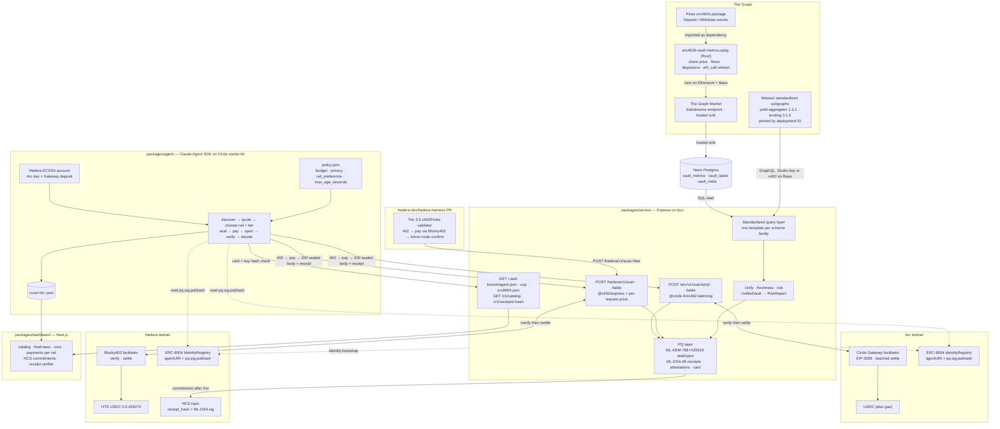
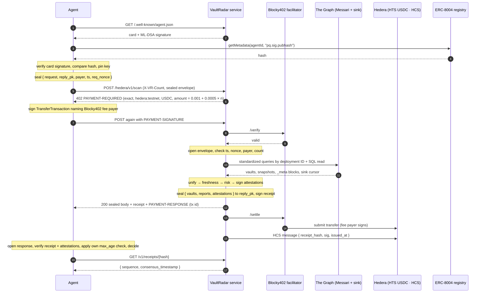

# VaultRadar architecture

Two diagrams: the system view and the flow of one paid request on the Hedera rail. Rendered PNGs live next to this file (`architecture.png`, `payment-flow.png`); regenerate with `node scripts/render-diagrams.mjs`.

## System view

## One paid request, Hedera rail

