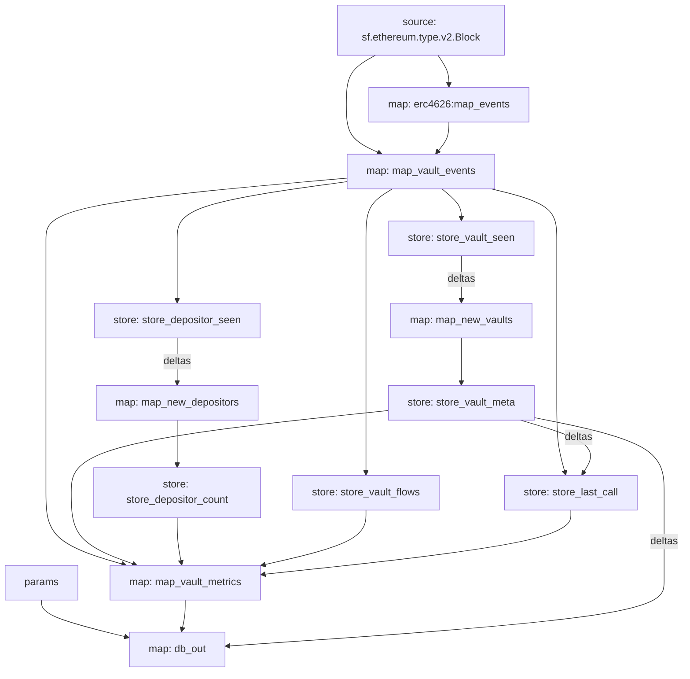

# erc4626-vault-metrics

A Substreams package that tracks per-vault share price, deposit/withdrawal flows, and depositor
counts for every ERC-4626 tokenized vault on a chain, and sinks the results into Postgres.

VaultRadar uses this package as its on-chain data source: `vault_latest` is the table a dashboard
queries for current vault state, `vault_metrics` is the append-only history behind any time-series
chart, and `vault_meta` is a one-row-per-vault lookup for the vault's underlying asset.

## What it computes

For every block, for every ERC-4626 vault that had a `Deposit` or `Withdraw` event:

- **`share_price`** — assets per share, as an 18-decimal fixed-point decimal string. Sourced from
  the block's own event data (`implied_share_price = assets / shares` on the log) by default, or
  from a direct `totalAssets()`/`totalSupply()` eth_call when one was made this block (see
  "Share price refresh" below). `share_price_source` records which (`"event"` or `"call"`).
- **`total_assets` / `total_supply`** — only populated on a `share_price_source: "call"` row; `NULL`
  otherwise, since an event alone doesn't carry the vault's aggregate totals.
- **`net_deposited_assets`** — cumulative deposits minus withdrawals for the vault, all-time.
- **`net_flow_assets`** — deposits minus withdrawals within this block only.
- **`depositor_count`** — count of distinct addresses that have ever deposited into the vault.
- **`last_event_block`** — the block being reported (redundant with `vault_metrics.block`, kept for
  parity with `vault_latest`, which has no other way to expose it once newer blocks arrive).

### Share price refresh

Event-sourced share price is cheap (no RPC) but only as trustworthy as the event's own
`assets`/`shares` fields. To cross-check it, `store_last_call` fetches `totalAssets()` and
`totalSupply()` directly from the vault contract via eth_call:

- **Once, unconditionally**, the first block a vault is ever seen in (so every tracked vault gets
  at least one ground-truth reading, not just high-activity ones).
- **Periodically after that**, at most once every 300 blocks per vault, on a block determined by a
  deterministic hash of the vault's own address (so refreshes are staggered across vaults instead
  of all firing on the same block).

A vault whose `asset()`/`decimals()`/`totalAssets()`/`totalSupply()` calls fail is skipped for that
attempt and logged; a vault that never successfully answers `asset()`/`decimals()` (for example, a
contract that emits `Deposit`/`Withdraw`-shaped events but isn't actually ERC-4626) never gets a
`vault_meta` row and is never retried, but still appears in `vault_metrics`/`vault_latest` from its
event data alone.

## Module graph

Composed on top of Pinax's public `erc4626` package
([`erc4626-v0.1.0.spkg`](https://github.com/pinax-network/substreams-evm)), which already extracts
raw `Deposit`/`Withdraw` events from every contract on the chain matching the ERC-4626 event
signatures — this package does no log-scanning of its own; `map_vault_events` is a thin transform
over Pinax's `map_events` output (renaming/normalizing fields, computing `implied_share_price`,
tagging each event with its vault address).



| Module | Kind | Purpose |
|---|---|---|
| `map_vault_events` | map | Normalizes Pinax's `Deposit`/`Withdraw` events, computes `implied_share_price` |
| `store_vault_seen` | store | `set_if_not_exists` marker per vault address, ever seen |
| `map_new_vaults` | map | Vaults seen for the first time this block (Create deltas of `store_vault_seen`) |
| `store_vault_meta` | store | Caches `asset`/`asset_symbol`/`asset_decimals`/`share_decimals` once per vault via eth_call |
| `store_depositor_seen` | store | `set_if_not_exists` marker per `(vault, depositor)`, ever deposited |
| `map_new_depositors` | map | New depositors this block (Create deltas of `store_depositor_seen`) |
| `store_depositor_count` | store | Running count of distinct depositors per vault |
| `store_vault_flows` | store | Running cumulative deposit/withdraw totals per vault |
| `store_last_call` | store | Most recent eth_call-sourced `totalAssets`/`totalSupply`/price per vault |
| `map_vault_metrics` | map | Joins the above into one `VaultMetrics` row per touched vault per block |
| `db_out` | map | Turns `VaultMetrics` + `VaultMeta` deltas into SQL `DatabaseChanges` |

## Database schema

See `schema.sql`. Three tables, all keyed by `(chain_id, vault[, block])` so mainnet and Base (or
any other EVM chain this is deployed against) can share one Postgres database:

- **`vault_metrics`** — append-only history, one row per `(chain_id, vault, block)` touched.
- **`vault_latest`** — one row per `(chain_id, vault)`, upserted (`db_out` uses `upsert_row`, which
  the sink turns into `INSERT ... ON CONFLICT (chain_id, vault) DO UPDATE`) to the most recent
  snapshot. Query this for "current" dashboard state.
- **`vault_meta`** — one row per `(chain_id, vault)`, inserted once when the vault's metadata is
  first cached (never updated afterward).

`total_assets`/`total_supply` are `NULL` on any row whose `share_price_source` is `"event"` rather
than `"call"` — `db_out` skips the SQL column write entirely for an empty value rather than writing
an empty string, so these columns are genuinely `NULL`, not `''`.

## `chain_id` / multi-chain

`db_out` takes `chain_id` as a Substreams runtime parameter (`params: string`), not a constant, so
the same compiled WASM module works for every chain — only the manifest's `params.db_out` value
and `network`/`initialBlock` differ between `substreams.yaml` (mainnet, `chain_id = "1"`) and
`substreams.base.yaml` (Base, `chain_id = "8453"`). Sinking both into the same Postgres database is
intentional and expected: every table's primary key includes `chain_id`.

## `initialBlock` policy

Each manifest's `map_vault_events.initialBlock` is chosen relative to each network's head at the
time this package was built, not a fixed historical constant — re-derive it before a fresh deploy
rather than reusing these numbers verbatim:

- **Mainnet**: `25742000` (chain head `25942379` at build time, minus 200,000 blocks, rounded down
  to the nearest 1,000).
- **Base**: `49899000` (chain head `51099244` at build time, minus 1,200,000 blocks — Base's ~2s
  block time means the same wall-clock lookback needs a larger block-count offset — rounded down
  to the nearest 1,000).

Every other module either inherits its effective start block from this dependency (has no
`initialBlock` of its own) or is itself `map_vault_events`.

## Building and packing

```bash
cd substreams/erc4626-vault-metrics
CARGO_INCREMENTAL=0 cargo build --target wasm32-unknown-unknown --release
substreams pack substreams.yaml -o erc4626-vault-metrics-v0.1.0.spkg
substreams pack substreams.base.yaml -o erc4626-vault-metrics-base-v0.1.0.spkg
```

## Sinking to Postgres (Neon)

Requires [`substreams-sink-sql`](https://github.com/streamingfast/substreams-sink-sql)
(`brew install streamingfast/tap/substreams-sink-sql`) and a `SUBSTREAMS_API_TOKEN` from
[thegraph.market](https://thegraph.market) (Substreams → API key). Point `DATABASE_URL` at your
Neon connection string (or any Postgres instance).

**One-time setup** (creates `vault_metrics`/`vault_latest`/`vault_meta` plus the sink's own cursor
table from `schema.sql` — run once per target database, not per chain):

```bash
substreams-sink-sql setup "$DATABASE_URL" ./erc4626-vault-metrics-v0.1.0.spkg
```

**Run the mainnet sink:**

```bash
substreams-sink-sql run "$DATABASE_URL" ./erc4626-vault-metrics-v0.1.0.spkg \
  -e mainnet.eth.streamingfast.io:443 --params db_out=1 --final-blocks-only
```

**Run the Base sink** (same database, different package/endpoint/param — both chains' rows
coexist because every table's primary key includes `chain_id`):

```bash
substreams-sink-sql run "$DATABASE_URL" ./erc4626-vault-metrics-base-v0.1.0.spkg \
  -e base-mainnet.streamingfast.io:443 --params db_out=8453 --final-blocks-only
```

Run both as long-lived background processes on the same host (Task 20 wires them into the Fly
machine as background processes; for a demo, running both from a laptop works identically).

**Verify data is flowing:**

```bash
psql "$DATABASE_URL" -c "SELECT chain_id, count(*) FROM vault_latest GROUP BY 1"
```

**Cursor table**: `substreams-sink-sql setup` creates a `cursors` table (columns: `id` text primary
key — the output module's hash, one row per sink/module pinned to this database — `cursor` text,
`block_num` bigint, `block_id` text). If a query elsewhere in this project reads sink progress
directly from Postgres, point it at `cursors`, not a differently-named table.

**Hosted alternative**: on [thegraph.market](https://thegraph.market), Hosted Sinks → New → point
at the published package below → Postgres → paste the Neon connection string → deploy. This runs
the same sink without a long-lived local/laptop process.

## Publishing to substreams.dev

```bash
substreams registry login
substreams registry publish ./erc4626-vault-metrics-v0.1.0.spkg
```

Published package: `<TODO: substreams.dev URL after publish>`
